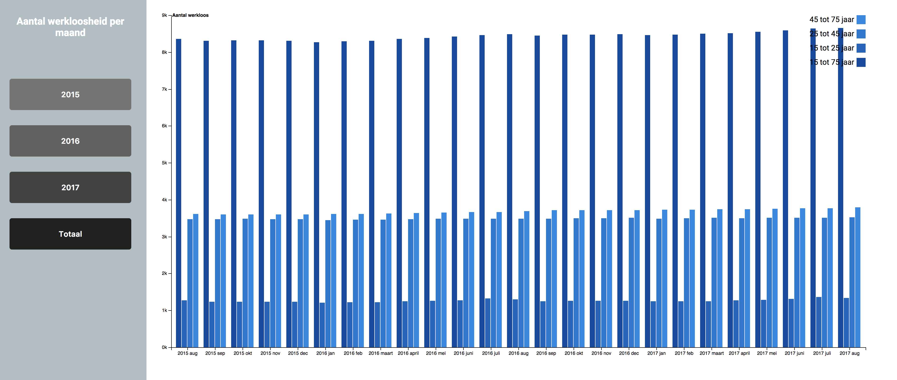

# ![Assessment 2][banner]
This is assessement 2 of Frontend 3. I've made a D3 chart of visualsing the amount of the labor participation and unemployment per month. This assignment is made with [D3](https://d3js.org/). I've chosen the [Grouped Bar Chart](https://bl.ocks.org/mbostock/3887051) to visualise my data. You can filter between the years and also the amount.



## Background
First of I copied the files from the original [Grouped Bar chart]. After that I've made a directory with the following files:

* `index.html`, This is basically the file that's being show in the browser.
* `index.css`, Stylesheet.
* `index.js`, Here is where the animations and the data is being loaded in.
* `index.csv`, This is the data.

### index.html
I've added a `<main>` and `<section>` to the file. The `<main>` I used for the CSS later on added the `<section>` tag for the `<button>` to sort the data on.
  
### index.css
In the index.css file I've positioned the body so that it's centered in the middle of the browser. To the `<main>` I've added 

### index.js
First of I copied the code from the original file. After that I looked into the file and read down the code to understand it. 
```javascript

``` 

The "width" and "height" is coming from the global variables:
```javascript

```

### index.csv
I used the data from the [CBS](http://statline.cbs.nl/statweb/publication/?vw=t&dm=slnl&pa=80590ned&d1=10,12&d2=a&d3=0&d4=(l-26)-l&hd=160414-1419&hdr=t,g1&stb=g2,g3) website. The data contains how much labor participation and unemployment per month in three years:

2015 example:

* `2015, August`
* `2015, September`
* `2015, October`
* `2015, November`
* `2015, December` and so on..

The data is a .CSV file. The data is a a little bit dirty with some minor mistakes. 

Example:

| Leeftijd          | Perioden          | Totaal    | Mannen    | Vrouwen   |
| ----------------- | ----------------- | --------- | ----------| ----------|  
| 15 tot 75 jaar    | 2015 augustus     | 8 353     | 4 500     | 3 853     | 
|                   | 2015 september    | 8 303     | 4 466     | 3 837     |
|                   | 2015 oktober      | 8 313     | 4 474     | 3 840     |
|                   | 2015 november     | 8 315     | 4 484     | 3 831     |
|                   | 2015 december     | 8 306     | 4 472     | 3 834     |

I loaded the data into my JS file. After that I removed some things in the file:

* `Removed the header and made a static header into the index.html file`
* `Removed the footer`
* `Removed the quotation marks and changed them into comma's`

## Features
* [D3](https://d3js.org/)
* [Original Bar chart](https://bl.ocks.org/mbostock/3887051)
* [Author](https://b.locks.org/mbostock)

## Thoughts
This assessment was really hard for me. I took a little bit time to load and clean up (a little bit I know!). I think a other chart would maybe be better for it. Maybe a map of a country with a slider that is showing the amount in the months or years.

## License

GPL 3.0 © 2017 Dylan van Zanten

[banner]: https://cdn.rawgit.com/cmda-fe3/logo/a4b0614/banner-assessment-2.svg
